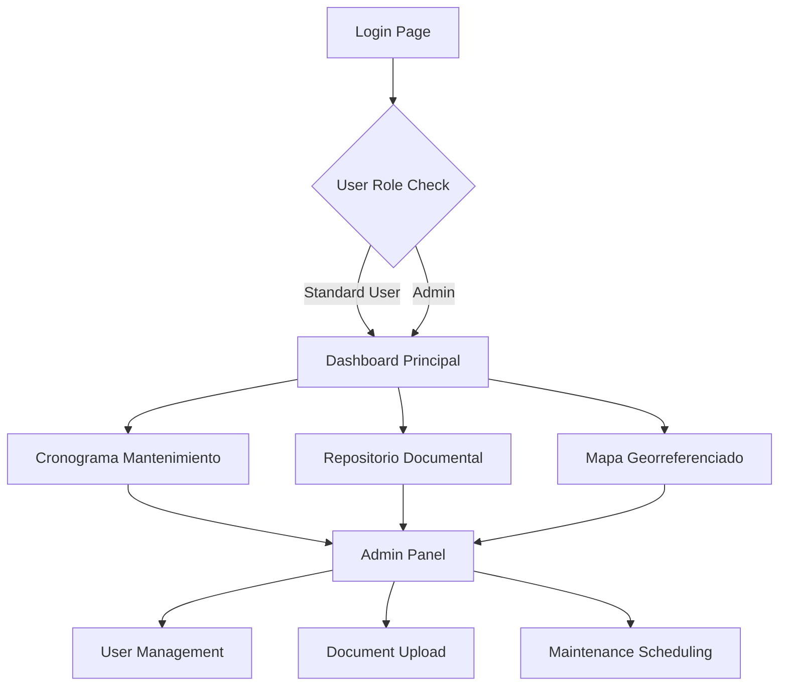

## 1. Product Overview
Aplicación web dockerizada para la gestión integral de Plantas de Tratamiento de Aguas Residuales (PTAR), permitiendo visualizar analíticas ambientales, cronogramas de mantenimiento, documentación técnica y geolocalización de plantas.

- **Problema a resolver**: Centralización de información técnica y operativa de PTAR para clientes y técnicos
- **Usuarios objetivo**: Administradores de plantas, técnicos ambientales, clientes de servicios de tratamiento
- **Valor del producto**: Control centralizado, seguimiento visual de mantenimientos, acceso seguro a información técnica

## 2. Core Features

### 2.1 User Roles
| Role | Registration Method | Core Permissions |
|------|---------------------|------------------|
| Administrador | Registro manual por superadmin | Crear/editar/eliminar registros, subir documentos, gestionar cronogramas |
| Usuario Estándar | Registro con aprobación admin | Visualizar información, descargar documentos y reportes |

### 2.2 Feature Module
El dashboard de PTAR consta de las siguientes páginas principales:

1. **Dashboard Principal**: visualización de analíticas ambientales, gráficos interactivos DQO/pH/SS, filtros por planta y fecha
2. **Cronograma de Mantenimiento**: diagrama de Gantt interactivo con estados de mantenimiento preventivo/correctivo
3. **Repositorio Documental**: explorador de carpetas por proyecto con búsqueda avanzada y descarga directa
4. **Mapa Georreferenciado**: visualización de plantas en mapa interactivo con información detallada al clickear
5. **Panel de Administración**: gestión de usuarios, plantas, documentos y cronogramas (solo admin)

### 2.3 Page Details
| Page Name | Module Name | Feature description |
|-----------|-------------|---------------------|
| Dashboard Principal | Analíticas Ambientales | Visualizar gráficos históricos de DQO, pH, Sólidos Suspendidos con filtros por planta, fecha y parámetro |
| Dashboard Principal | Exportación de Datos | Descargar datos en formato PDF y Excel, generar comparativas entre periodos o plantas |
| Cronograma Mantenimiento | Diagrama Gantt | Mostrar mantenimientos anuales con tipo, fechas ejecutadas/próximas, estado pendiente/realizado |
| Cronograma Mantenimiento | Gestión de Tareas | Crear/editar/eliminar tareas de mantenimiento (solo administradores) |
| Repositorio Documental | Explorador de Carpetas | Navegar carpetas por proyecto con informes técnicos, memorias, planos, fotografías |
| Repositorio Documental | Búsqueda Avanzada | Buscar por palabra clave, tipo de archivo o proyecto con descarga directa |
| Mapa Georreferenciado | Visualización de Plantas | Mostrar marcadores interactivos de PTAR con coordenadas, nombre, estado, último mantenimiento |
| Mapa Georreferenciado | Información Detallada | Enlace directo a carpeta documental de cada planta al hacer clic en marcador |
| Panel Administración | Gestión de Usuarios | Crear/editar roles de usuario con control de acceso basado en JWT |
| Panel Administración | Gestión de Plantas | Agregar/editar información de PTAR incluyendo coordenadas y datos técnicos |
| Login/Autenticación | Sistema de Login | Autenticación segura con JWT, redirección según rol de usuario |

## 3. Core Process

### Flujo de Usuario Estándar
1. Usuario accede al login y se autentica con credenciales
2. Visualiza el dashboard principal con analíticas ambientales
3. Navega al cronograma de mantenimiento para ver tareas programadas
4. Explora el repositorio documental para descargar informes técnicos
5. Consulta el mapa georreferenciado para ubicación de plantas

### Flujo de Administrador
1. Admin accede con credenciales de administrador
2. Gestiona usuarios y asigna permisos apropiados
3. Carga documentos técnicos al repositorio documental
4. Programa y actualiza tareas de mantenimiento en el cronograma
5. Actualiza información de plantas y coordenadas en el mapa

## 4. User Interface Design

### 4.1 Design Style
- **Colores primarios**: Azul industrial (#1E40AF) y verde ambiental (#059669)
- **Colores secundarios**: Gris neutro (#6B7280) y blanco (#FFFFFF)
- **Estilo de botones**: Rounded corners con sombra sutil, hover effects
- **Tipografía**: Inter para headers, Roboto para contenido, tamaños 14-18px
- **Layout**: Card-based con navegación lateral collapsable
- **Iconos**: Feather Icons para consistencia visual

### 4.2 Page Design Overview
| Page Name | Module Name | UI Elements |
|-----------|-------------|-------------|
| Dashboard Principal | Analíticas Ambientales | Cards con gráficos Recharts, filtros dropdown, botones de exportación en toolbar superior |
| Cronograma Mantenimiento | Diagrama Gantt | Timeline horizontal interactivo, leyenda de colores por tipo de mantenimiento, panel lateral de detalles |
| Repositorio Documental | Explorador de Carpetas | Tree view con iconos de carpetas, preview de documentos, barra de búsqueda con filtros |
| Mapa Georreferenciado | Visualización de Plantas | Mapa Leaflet fullscreen, popup modales con info de planta, cluster de marcadores para zonas densas |
| Panel Administración | Gestión de Usuarios | Tabla paginada de usuarios, formularios modales CRUD, badges de rol con colores diferenciados |

### 4.3 Responsiveness
- **Diseño**: Desktop-first con breakpoints para tablet (768px) y móvil (640px)
- **Adaptación**: Menú hamburguesa en móvil, gráficos responsivos, mapa touch-friendly
- **Optimización**: Lazy loading de imágenes, paginación server-side para listados extensos