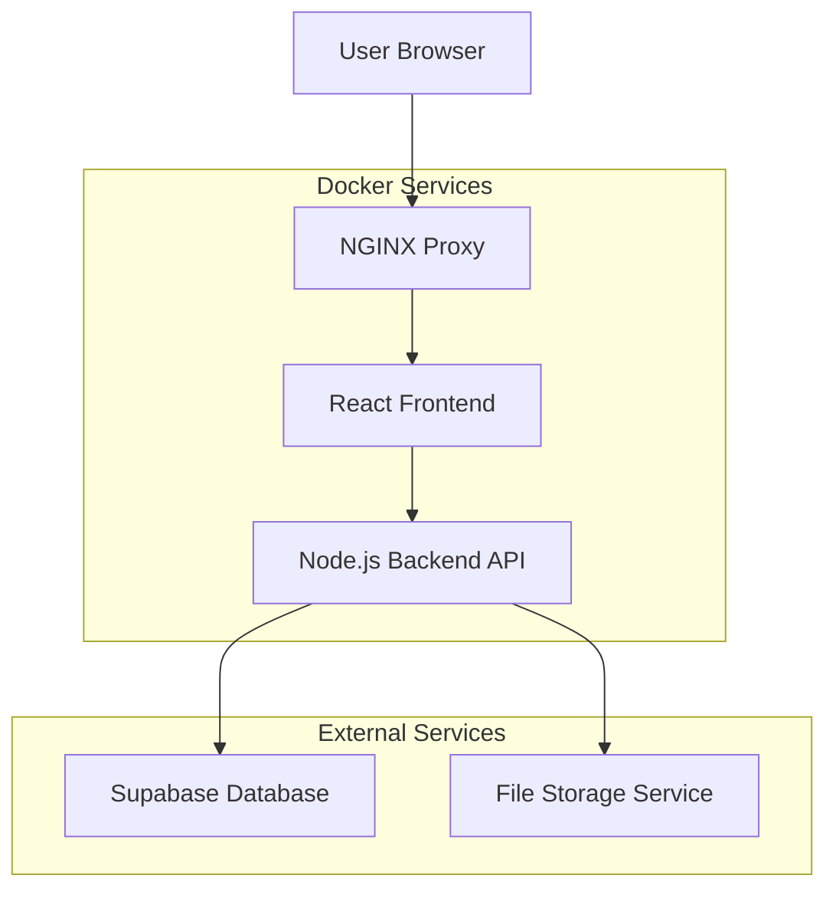
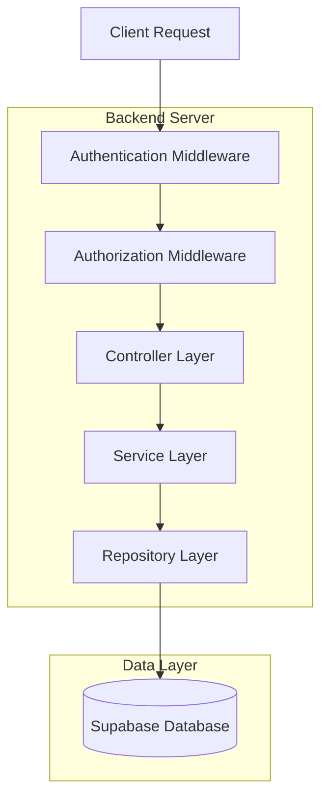
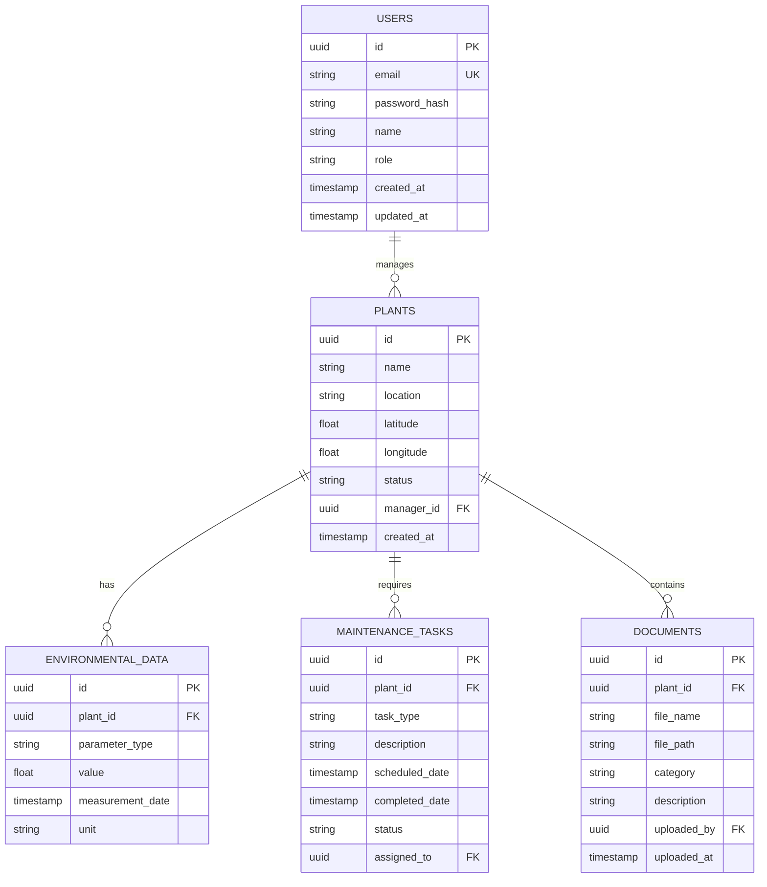

## 1. Architecture Design



## 2. Technology Description

- **Frontend**: React@18 + TailwindCSS@3 + Vite
- **Initialization Tool**: vite-init
- **Backend**: Node.js@18 + Express@4
- **Database**: Supabase (PostgreSQL)
- **Authentication**: Supabase Auth (JWT-based)
- **Charts**: Recharts@2
- **Gantt Charts**: react-gantt-timeline
- **Maps**: Leaflet@1.9 + React-Leaflet
- **File Upload**: Multer + Supabase Storage

## 3. Route Definitions

| Route | Purpose |
|-------|---------|
| / | Dashboard principal con analíticas ambientales |
| /login | Página de autenticación de usuarios |
| /dashboard | Dashboard con gráficos de indicadores DQO/pH/SS |
| /maintenance | Cronograma de mantenimiento con diagrama Gantt |
| /documents | Repositorio documental con explorador de carpetas |
| /map | Mapa georreferenciado de plantas PTAR |
| /admin | Panel de administración (solo admin) |
| /admin/users | Gestión de usuarios y roles |
| /admin/plants | Gestión de plantas PTAR |
| /api/auth/* | Endpoints de autenticación |
| /api/analytics/* | Endpoints de datos ambientales |
| /api/maintenance/* | Endpoints de cronograma de mantenimiento |
| /api/documents/* | Endpoints de gestión documental |

## 4. API Definitions

### 4.1 Authentication APIs

```
POST /api/auth/login
```

Request:
| Param Name | Param Type | isRequired | Description |
|------------|-------------|-------------|-------------|
| email | string | true | Correo electrónico del usuario |
| password | string | true | Contraseña del usuario |

Response:
| Param Name | Param Type | Description |
|------------|-------------|-------------|
| user | object | Datos del usuario (id, email, role) |
| token | string | JWT token para autenticación |
| refreshToken | string | Token para renovar sesión |

### 4.2 Analytics APIs

```
GET /api/analytics/environmental
```

Request Query Parameters:
| Param Name | Param Type | isRequired | Description |
|------------|-------------|-------------|-------------|
| plantId | string | false | ID de la planta PTAR |
| startDate | string | false | Fecha inicial (ISO 8601) |
| endDate | string | false | Fecha final (ISO 8601) |
| parameter | string | false | Tipo de parámetro (DQO, pH, SS) |

Response:
| Param Name | Param Type | Description |
|------------|-------------|-------------|
| data | array | Array de objetos con timestamp, valor, parámetro, planta |
| summary | object | Estadísticas agregadas por parámetro |

### 4.3 Maintenance APIs

```
POST /api/maintenance/tasks
```

Request:
| Param Name | Param Type | isRequired | Description |
|------------|-------------|-------------|-------------|
| plantId | string | true | ID de la planta PTAR |
| type | string | true | Tipo de mantenimiento (preventivo/correctivo/general) |
| scheduledDate | string | true | Fecha programada (ISO 8601) |
| description | string | true | Descripción de la tarea |

### 4.4 Document APIs

```
POST /api/documents/upload
```

Request (multipart/form-data):
| Param Name | Param Type | isRequired | Description |
|------------|-------------|-------------|-------------|
| file | file | true | Archivo a subir |
| plantId | string | true | ID de la planta relacionada |
| category | string | true | Categoría del documento |
| description | string | false | Descripción opcional |

## 5. Server Architecture Diagram



## 6. Data Model

### 6.1 Database Schema



### 6.2 Database Definition Language

**Users Table**
```sql
CREATE TABLE users (
    id UUID PRIMARY KEY DEFAULT gen_random_uuid(),
    email VARCHAR(255) UNIQUE NOT NULL,
    password_hash VARCHAR(255) NOT NULL,
    name VARCHAR(100) NOT NULL,
    role VARCHAR(20) DEFAULT 'standard' CHECK (role IN ('admin', 'standard')),
    created_at TIMESTAMP WITH TIME ZONE DEFAULT NOW(),
    updated_at TIMESTAMP WITH TIME ZONE DEFAULT NOW()
);

-- Grant permissions
GRANT SELECT ON users TO anon;
GRANT ALL PRIVILEGES ON users TO authenticated;
```

**Plants Table**
```sql
CREATE TABLE plants (
    id UUID PRIMARY KEY DEFAULT gen_random_uuid(),
    name VARCHAR(255) NOT NULL,
    location VARCHAR(255) NOT NULL,
    latitude DECIMAL(10, 8) NOT NULL,
    longitude DECIMAL(11, 8) NOT NULL,
    status VARCHAR(20) DEFAULT 'active' CHECK (status IN ('active', 'inactive', 'maintenance')),
    manager_id UUID REFERENCES users(id),
    created_at TIMESTAMP WITH TIME ZONE DEFAULT NOW(),
    updated_at TIMESTAMP WITH TIME ZONE DEFAULT NOW()
);

-- Create indexes
CREATE INDEX idx_plants_manager_id ON plants(manager_id);
CREATE INDEX idx_plants_status ON plants(status);

-- Grant permissions
GRANT SELECT ON plants TO anon;
GRANT ALL PRIVILEGES ON plants TO authenticated;
```

**Environmental Data Table**
```sql
CREATE TABLE environmental_data (
    id UUID PRIMARY KEY DEFAULT gen_random_uuid(),
    plant_id UUID NOT NULL REFERENCES plants(id) ON DELETE CASCADE,
    parameter_type VARCHAR(10) NOT NULL CHECK (parameter_type IN ('DQO', 'pH', 'SS')),
    value DECIMAL(10, 2) NOT NULL,
    measurement_date TIMESTAMP WITH TIME ZONE NOT NULL,
    unit VARCHAR(20) NOT NULL,
    created_at TIMESTAMP WITH TIME ZONE DEFAULT NOW()
);

-- Create indexes
CREATE INDEX idx_env_data_plant_id ON environmental_data(plant_id);
CREATE INDEX idx_env_data_parameter ON environmental_data(parameter_type);
CREATE INDEX idx_env_data_date ON environmental_data(measurement_date DESC);

-- Grant permissions
GRANT SELECT ON environmental_data TO anon;
GRANT ALL PRIVILEGES ON environmental_data TO authenticated;
```

**Maintenance Tasks Table**
```sql
CREATE TABLE maintenance_tasks (
    id UUID PRIMARY KEY DEFAULT gen_random_uuid(),
    plant_id UUID NOT NULL REFERENCES plants(id) ON DELETE CASCADE,
    task_type VARCHAR(20) NOT NULL CHECK (task_type IN ('preventive', 'corrective', 'general')),
    description TEXT NOT NULL,
    scheduled_date DATE NOT NULL,
    completed_date DATE,
    status VARCHAR(20) DEFAULT 'pending' CHECK (status IN ('pending', 'completed', 'overdue')),
    assigned_to UUID REFERENCES users(id),
    created_at TIMESTAMP WITH TIME ZONE DEFAULT NOW(),
    updated_at TIMESTAMP WITH TIME ZONE DEFAULT NOW()
);

-- Create indexes
CREATE INDEX idx_maintenance_plant_id ON maintenance_tasks(plant_id);
CREATE INDEX idx_maintenance_status ON maintenance_tasks(status);
CREATE INDEX idx_maintenance_scheduled_date ON maintenance_tasks(scheduled_date);

-- Grant permissions
GRANT SELECT ON maintenance_tasks TO anon;
GRANT ALL PRIVILEGES ON maintenance_tasks TO authenticated;
```

**Documents Table**
```sql
CREATE TABLE documents (
    id UUID PRIMARY KEY DEFAULT gen_random_uuid(),
    plant_id UUID NOT NULL REFERENCES plants(id) ON DELETE CASCADE,
    file_name VARCHAR(255) NOT NULL,
    file_path VARCHAR(500) NOT NULL,
    category VARCHAR(50) NOT NULL CHECK (category IN ('technical_report', 'calculation_memory', 'blueprint', 'photo', 'other')),
    description TEXT,
    uploaded_by UUID NOT NULL REFERENCES users(id),
    uploaded_at TIMESTAMP WITH TIME ZONE DEFAULT NOW()
);

-- Create indexes
CREATE INDEX idx_documents_plant_id ON documents(plant_id);
CREATE INDEX idx_documents_category ON documents(category);
CREATE INDEX idx_documents_uploaded_by ON documents(uploaded_by);

-- Grant permissions
GRANT SELECT ON documents TO anon;
GRANT ALL PRIVILEGES ON documents TO authenticated;
```

## 7. Docker Configuration

### 7.1 Docker Compose Configuration
```yaml
version: '3.8'

services:
  frontend:
    build: ./frontend
    ports:
      - "3000:3000"
    environment:
      - VITE_API_URL=http://backend:5000
    depends_on:
      - backend
    volumes:
      - ./frontend:/app
      - /app/node_modules

  backend:
    build: ./backend
    ports:
      - "5000:5000"
    environment:
      - NODE_ENV=production
      - SUPABASE_URL=${SUPABASE_URL}
      - SUPABASE_ANON_KEY=${SUPABASE_ANON_KEY}
      - SUPABASE_SERVICE_KEY=${SUPABASE_SERVICE_KEY}
      - JWT_SECRET=${JWT_SECRET}
    depends_on:
      - nginx
    volumes:
      - ./backend:/app
      - /app/node_modules
      - uploads:/app/uploads

  nginx:
    image: nginx:alpine
    ports:
      - "80:80"
      - "443:443"
    volumes:
      - ./nginx/nginx.conf:/etc/nginx/nginx.conf
      - ./nginx/ssl:/etc/nginx/ssl
    depends_on:
      - frontend
      - backend

volumes:
  uploads:
    driver: local
```

### 7.2 Environment Variables (.env)
```bash
# Supabase Configuration
SUPABASE_URL=https://your-project.supabase.co
SUPABASE_ANON_KEY=your-anon-key
SUPABASE_SERVICE_KEY=your-service-key

# Security
JWT_SECRET=your-jwt-secret-key-min-32-characters

# Application Settings
NODE_ENV=production
PORT=5000

# File Upload
MAX_FILE_SIZE=10485760
UPLOAD_PATH=./uploads

# Email Configuration (opcional)
SMTP_HOST=smtp.gmail.com
SMTP_PORT=587
SMTP_USER=your-email@gmail.com
SMTP_PASS=your-app-password
```

## 8. Security Implementation

### 8.1 Authentication Flow
1. Usuario envía credenciales a `/api/auth/login`
2. Backend verifica contra Supabase Auth
3. Se genera JWT token con claims de usuario
4. Token se valida en cada request mediante middleware
5. Refresh token permite renovar sesión

### 8.2 Authorization
- Middleware de rol verifica permisos en cada endpoint
- Admin: acceso completo a todos los recursos
- Standard: solo lectura y descarga de documentos
- Validación de input con express-validator
- Rate limiting para prevenir ataques de fuerza bruta

### 8.3 Data Protection
- HTTPS obligatorio en producción
- Sanitización de inputs para prevenir SQL injection
- Headers de seguridad con helmet.js
- CORS configurado para dominios específicos
- Encriptación de contraseñas con bcrypt

## 9. Deployment Instructions

### 9.1 Development Setup
```bash
# Clonar repositorio
git clone <repository-url>
cd ptar-dashboard

# Configurar variables de entorno
cp .env.example .env
# Editar .env con tus configuraciones

# Instalar dependencias
cd frontend && npm install
cd ../backend && npm install

# Iniciar servicios
docker-compose up -d
```

### 9.2 Production Deployment
```bash
# Build de producción
docker-compose -f docker-compose.prod.yml build

# Desplegar servicios
docker-compose -f docker-compose.prod.yml up -d

# Verificar estado
docker-compose ps

# Ver logs
docker-compose logs -f
```

### 9.3 Backup Strategy
- Base de datos: Supabase maneja backups automáticos
- Archivos: Volumen Docker con backup programado
- Configuración: Versionado en Git con tags por release